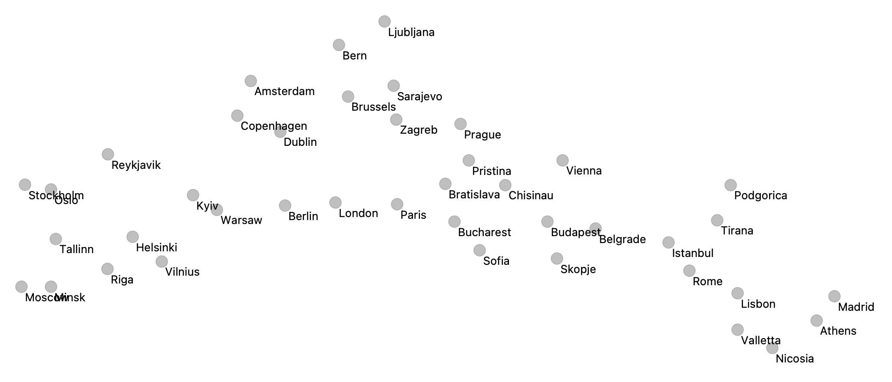

Na podatkih o podnebju (mesečnih temperaturah in količini padavin) evropskih mest smo izvedli metodo t-SNE in dobili spodnji razsevni diagram.



Koordinate smo shranili v `climate-europe.tab`. 

Na voljo imate še seznam skupin mest v `groups.yaml`. V eni od njih je tudi Ljubljana:

```
Scenic_Smaller_Capitals:
  - Ljubljana
  - Reykjavik
  - Tallinn
  - Valletta
  - Sarajevo
```

V nalogi boste spoznali, kako lahko na podlagi razsevnega diagrama okarakteriziramo obstoječe skupine.

Implementirajte funkcijo `unusual_group_pval`, ki za podatke s koordinatami t-SNE in podano skupino pove, kako verjetno je, da so elementi naključno izbrane skupine (iste velikosti) vsaj tako blizu kot v podani skupini: s tem dobite *p*-vrednost.

Za izračun bližine elementov skupine uporabite povprečno **evklidsko** razdaljo med **vsemi pari** elementov skupine, ki jo implementirajte kot funkcijo `mean_distance_group_allpairs`.

Za izračun p-vrednosti primerjajte povprečno razdaljo podane skupine s 1000 povprečnimi razdaljami naključno izbranih skupin enake velikosti.

Pri implementaciji lahko uporabite samo standardne Pythonove knjižnice ter knjižnico za branje datotek `yaml`. Implementacijo shranite v eno samo datoteko `explain_tsne.py`. Rešitev preverite z ukazom:

```
python -m unittest -v test_explain_tsne
```